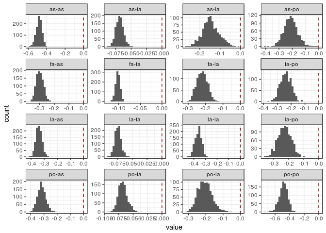
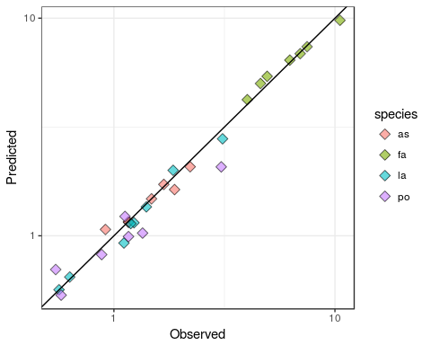
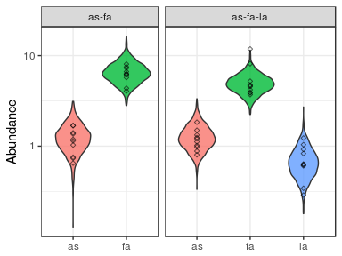
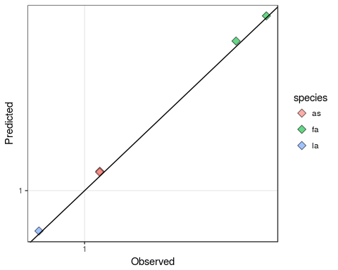

Fitting endpoints: Bayesian approach
================
Daniel Maynard, Zachary Miller and Stefano Allesina

Here we show how to fit the endpoints or predict out of fit using the
Bayesian approach, as presented in the main text. This method accounts
for log-normal measurement error in each endpoint abundance, and for the
fact that each endpoint appears in multiple different equations. This
method is the recommended approach for fitting this model, though it is
computationally more intensive.

All the code needed for the analysis is in the file `bayes.R`. The
Bayesian MCMC algorithm is implemented in the Stan programming language,
which is called here from within `R`. The details of model is given in
`Stan_file.stan`, which instructs the MCMC sampler how to calculate the
log-likelihood at each step. Please see <https://mc-stan.org/> for
instructions on installing and implementing Stan. In addition to Stan,
the libraries `rstan`, `tidyverse`, and `coda` need to be installed for
this code to run.

First we source the `R` functions in the `bayes.R` script:

``` r
source("bayes.R")
```

### Step 1: label the data

The data file should be in csv format, with one column for each species,
and one row for each recorded endpoint. The header should specify the
name of the species:

``` r
dt <- read_csv("../../data/Kuebbing_plants/natives.csv")
dt %>% sample_n(10) # show 10 endpoints sampled at random
```

    ## # A tibble: 10 x 4
    ##        as     fa     la     po
    ##     <dbl>  <dbl>  <dbl>  <dbl>
    ##  1 0.0000 5.7740 0.0000 0.0000
    ##  2 1.3212 2.5017 0.0000 0.0000
    ##  3 0.0000 0.0000 0.5178 3.9811
    ##  4 2.7389 1.7205 0.6208 0.0000
    ##  5 1.8360 3.3019 0.0000 0.0000
    ##  6 0.0000 4.3215 1.4273 0.0000
    ##  7 0.0000 0.0000 0.8931 0.0000
    ##  8 0.0000 0.0000 0.0000 3.9907
    ##  9 0.0000 8.0686 0.0000 0.0000
    ## 10 2.9240 2.3903 0.2379 4.3230

The function `prepare_data` simply adds a column containing a label for
the
community:

``` r
dt <- prepare_data("~/Git/endpoints/github/data/Kuebbing_plants/invasives.csv")
dt %>% sample_n(10)
```

    ## # A tibble: 10 x 5
    ##        as      fa     la     po   community
    ##     <dbl>   <dbl>  <dbl>  <dbl>       <chr>
    ##  1 2.1871  0.0000 0.0000 0.0000          as
    ##  2 0.0000  8.5424 0.0000 1.5651       fa-po
    ##  3 0.0000 10.0422 0.0000 0.0000          fa
    ##  4 0.0000  0.0000 1.8329 1.1232       la-po
    ##  5 0.0000  4.8948 1.1617 1.0609    fa-la-po
    ##  6 0.9668  4.3570 0.5509 0.6385 as-fa-la-po
    ##  7 0.0000  0.0000 0.8733 1.7766       la-po
    ##  8 2.2107  0.0000 1.0487 0.9990    as-la-po
    ##  9 0.0000  0.0000 0.0000 3.9313          po
    ## 10 1.6836  4.0592 0.0000 0.0000       as-fa

### Step 2: fitting all endpoints

To use all of the available data to estimate *B* via a Bayesian
approach, call the function `fit_stan`, which calls the `stan` function
within R. The `fit_stan` function allows you to adjust several
parameters:

  - `stan_file` gives the location of the Stan file used for fitting.
  - `exclude` specifies which communities to exclude. If set to `NULL`
    (default) all endpoints are used. Otherwise it takes a character
    vector of communities to exclude, e.g., `c("fa","fa-po")`.
  - `B_upper` is a binary matrix of dimension *n x n* indicating the
    upper bounds on each entry of B. A matrix of all *1*s would specify
    no upper bound for any element; a matrix with *1*s on the
    off-diagonal and *0* on the diagonal would constrain the diagonal
    entries to be negative, and so on. The default is a purely
    competitive community (`B_upper = 0`).
  - `B_lower` is a binary matrix of dimension *n x n* indicating the
    lower bounds on each entry of B. A matrix of all *-1*s would specify
    no lower bound for any element; a matrix with *-1*s on the
    off-diagonal and *0* on the diagonal would constrain the diagonal
    entries to be positive. The defaults is no lower bound (`B_upper =
    -1`).
  - `chains` the number of MCMC chains to run.
  - `cores` the number of processor cores to use.
  - `iter` the number of MCMC iterations.
  - `warmup` the number of warm-up iterations before sampling.
  - `thin` the number of iterations to skip between samples.
  - `delta` the adaptive delta value used in the MCMC routine (default
    is `0.85`)
  - `treedepth` the maximum tree depth used in the MCMC routine (default
    is `12`)
  - `seed` the random seem for the Stan function (default is `10`).

Here we fit two short chains (15000 iterations) to the full native plant
data, using two cores:

``` r
stan_results <- fit_stan(dt, stan_file = "Stan_file.stan", chains = 2, 
                   cores = 2, iter = 15000, warmup = 7500, thin = 15)
```

    ## [1] "fitting all endpoints"

#### Plotting diagnostics

The resulting output is a named list that contains the details of the
fit (original data, excluded communities, number of iterations, etc.) as
well as the MCMC results. For example, here are the first 10 iterations
of the MCMC run, showing the first 4 coefficients (first column) of *B*:

``` r
as.matrix(stan_results$stan_fit)[1:10,1:4]
```

    ##           parameters
    ## iterations     B[1,1]     B[2,1]     B[3,1]     B[4,1]
    ##       [1,] -0.5328057 -0.2839620 -0.3353062 -0.3290068
    ##       [2,] -0.4779880 -0.3261698 -0.3427691 -0.3064889
    ##       [3,] -0.4913929 -0.3058900 -0.3470635 -0.3456598
    ##       [4,] -0.5104740 -0.3098990 -0.3547663 -0.3615822
    ##       [5,] -0.4870523 -0.2798054 -0.3157933 -0.3233266
    ##       [6,] -0.5222454 -0.3282684 -0.3886589 -0.3687836
    ##       [7,] -0.4692390 -0.2255070 -0.3162500 -0.2670632
    ##       [8,] -0.4918623 -0.3055414 -0.3324342 -0.3177148
    ##       [9,] -0.5171210 -0.3460761 -0.3650876 -0.3601723
    ##      [10,] -0.4683844 -0.3024604 -0.3386943 -0.3623554

From this output, we can plot diagnostics by calling the
`plot_diagnostics` function, specifying either histograms of the entries
of *B* (`show_plot = "hist"`) or the full MCMC output across all
iterations (`show_plot = "chains"`), or both. Here we plot the histogram
of the posterior of
    *B*:

``` r
plot_diagnostics(stan_results, show_plot = "hist") 
```

    ## [1] "Plotting histogram of B"

    ## `stat_bin()` using `bins = 30`. Pick better value with `binwidth`.

<!-- -->

### Step 3: predicting endpoints

To predict the endpoint abundance for a specific subset of species *s*,
we first take a random bootstrap sample from the posterior of *B* and
the species-specific standard deviations. We then subset these elements
by taking only the entries corresponding to *s*, and calculate the
negative row sum of the resulting sub-matrix. To estimate the prediction
interval, which takes into account the error, we can sample this
endpoint abundance from a log-normal distribution with the posterior
standard deviation.

This process is implemented in the `boostrap_results` function, which
takes the previous `stan_results` list, along with a specified number of
bootstrap samples, here set to 500:

``` r
br <- bootstrap_results(stan_results, nboot=1500)
```

    ## [1] "Bootstrapping community 1 of 15"
    ## [1] "Bootstrapping community 2 of 15"
    ## [1] "Bootstrapping community 3 of 15"
    ## [1] "Bootstrapping community 4 of 15"
    ## [1] "Bootstrapping community 5 of 15"
    ## [1] "Bootstrapping community 6 of 15"
    ## [1] "Bootstrapping community 7 of 15"
    ## [1] "Bootstrapping community 8 of 15"
    ## [1] "Bootstrapping community 9 of 15"
    ## [1] "Bootstrapping community 10 of 15"
    ## [1] "Bootstrapping community 11 of 15"
    ## [1] "Bootstrapping community 12 of 15"
    ## [1] "Bootstrapping community 13 of 15"
    ## [1] "Bootstrapping community 14 of 15"
    ## [1] "Bootstrapping community 15 of 15"

From this, we can plot the results using the `plot_boot_results`
function, either specifying the median observed vs. predicted values
(`show_plot = "obs_pred"`) or the violin plots of the prediction
intervals (`show_plot = "violin"`), or both. If no communities were
excluded from the fitting process, this function will plot all the
posterior prediction interval of all communities, including unobserved
communities (e.g., `as-la-po`):

``` r
plot_boot_results(br, show_plot = "violin")
```

    ## [1] "Plotting violin plots"

<!-- -->

``` r
plot_boot_results(br, show_plot = "obs_pred")
```

    ## [1] "Plotting observed vs. predicted medians"

<!-- -->

### Step 4: predicting out-of-fit

We can repeat this above analysis, but with the removal of one or more
communities to test the out-of-fit predictions. To do this, we provide
the omitted communities as a character vector in the `exclude` argument
when we call `fit_stan`. Importantly, this function performs a check on
the endpoint matrix: if we exclude too many communities, or if the
original endpoint matrix contain an insufficient number of endpoints to
fit *B*, then this function will return an error before calling Stan.
Here, for example, we exclude too many communities, such that species
`as` and `fa` never occur
together:

``` r
stan_reduced <- fit_stan(dt, exclude = c("as-fa","as-fa-la","as-fa-la-po"),
                         stan_file = "Stan_file.stan", chains = 2, cores = 2, iter = 15000, 
                         warmup = 7500, thin = 15, seed=12)
```

    ## [1] "excluding communities as-fa, as-fa-la, as-fa-la-po"

    ## Error in check_endpoints(E): Not enough endpoints to fit

Otherwise, provided there are enough endpoints, the specified
communities are removed from the dataset, and *B* is estimated using the
reduced data:

``` r
stan_reduced <- fit_stan(dt, exclude = c("as-fa","as-fa-la"),
                         stan_file = "Stan_file.stan", chains = 2, cores = 2, iter = 15000, 
                         warmup = 7500, thin = 15, seed=12)
```

    ## [1] "excluding communities as-fa, as-fa-la"

After bootstrapping these results, the `plot_boot_results` function
plots the predictions for the omitted communities:

``` r
br_reduced <- bootstrap_results(stan_reduced, nboot=1500)
```

    ## [1] "Bootstrapping community 1 of 2"
    ## [1] "Bootstrapping community 2 of 2"

``` r
plot_boot_results(br_reduced, show_plot = "violin")
```

    ## [1] "Plotting violin plots"

<!-- -->

``` r
plot_boot_results(br_reduced, show_plot = "obs_pred")
```

    ## [1] "Plotting observed vs. predicted medians"

<!-- -->
